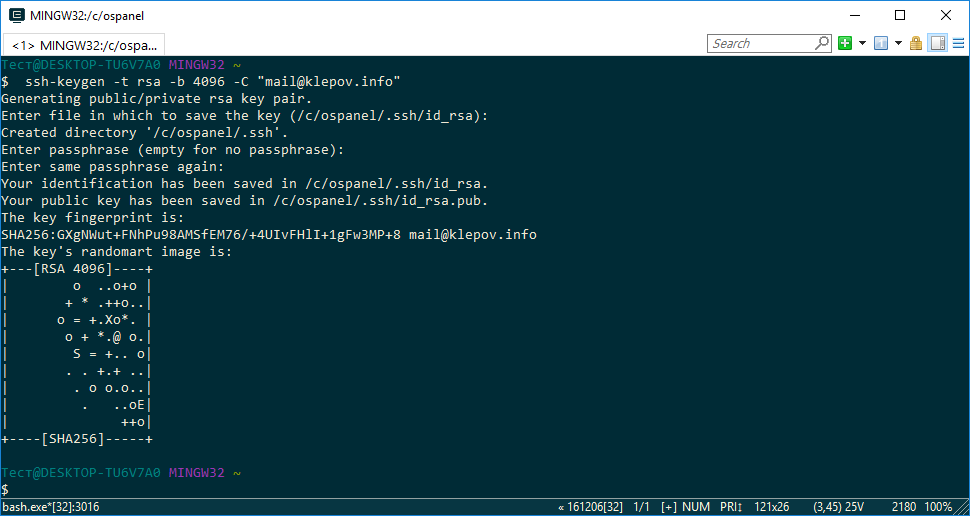
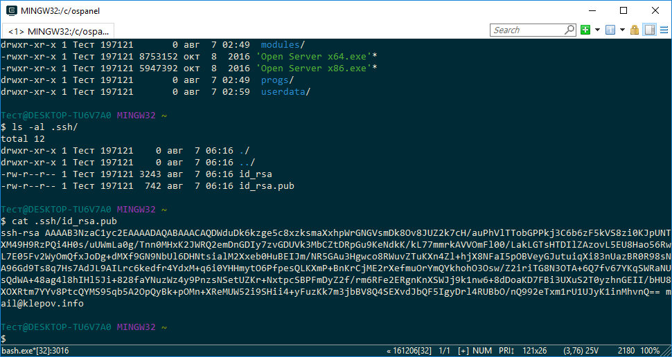

# 2. Генерация ключей или привязка уже существующих к консоли OpenServer-a
### 2.1 Генерация ключей
``` bash
ssh-keygen -t rsa -b 4096 -C "mail@klepov.info"
```


После этого в корне OpenServer-а появится папка .ssh, в которой будут находится ключи. Следующей коммандой можно просмотреть ключ
``` bash
cat .ssh/id_rsa.pub
```


### 2.2 Привязка уже существующих ключей
Для этого необходимо скопировать папку (.ssh) с клюючами в корень папки OpenServer-a, или создать папку .ssh и поместить ключи туда, обычно в Windows ключи находятся в корневой папке пользователя.


    


