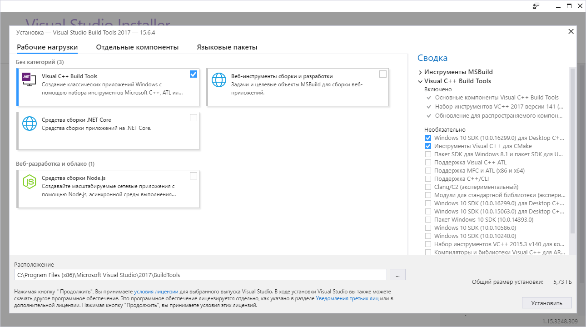
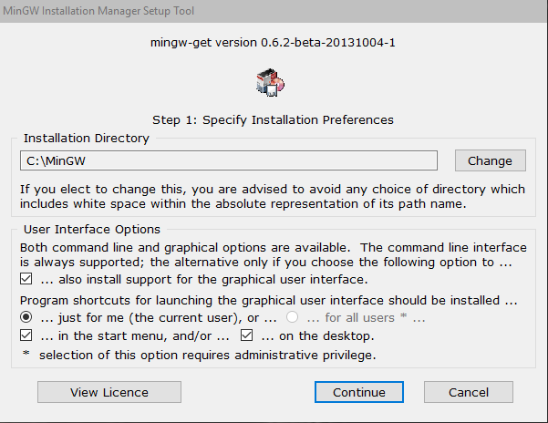
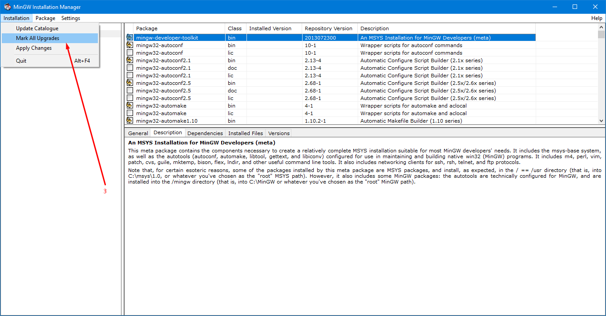
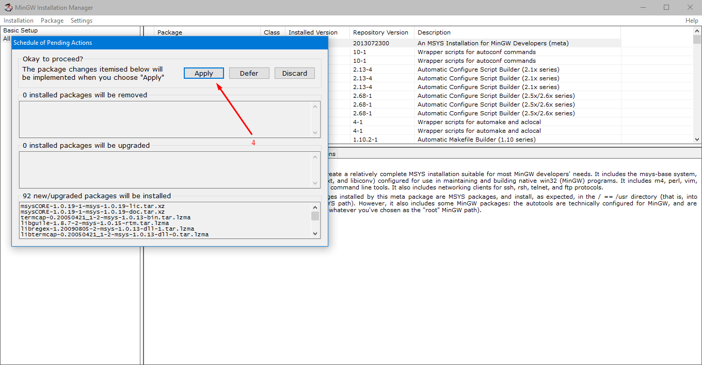
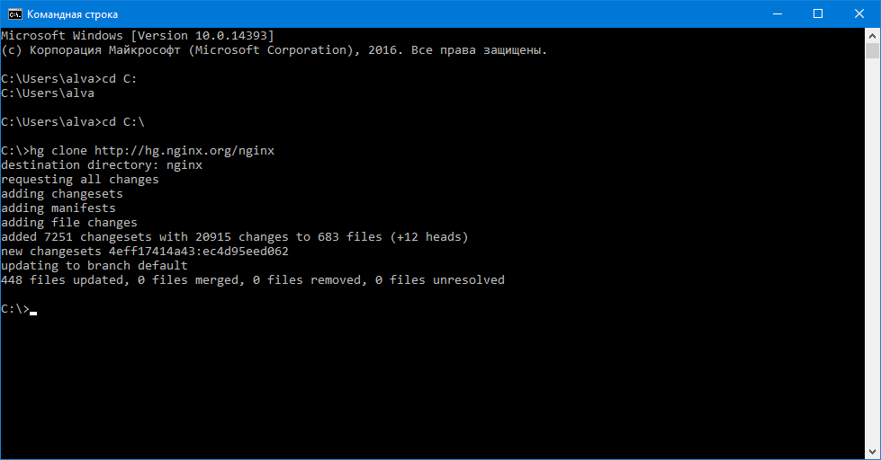
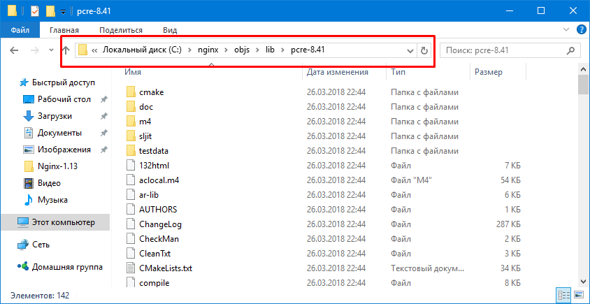
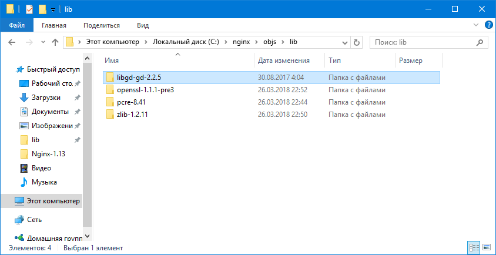
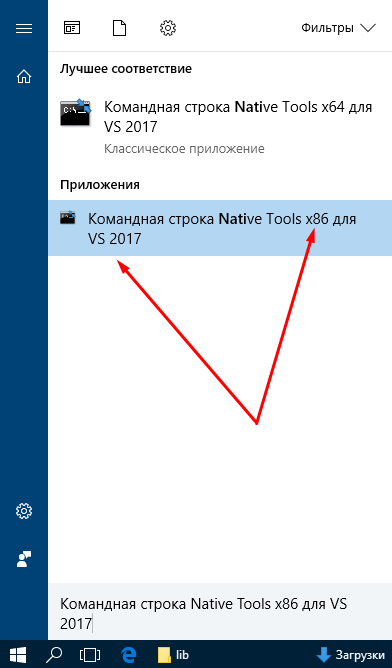
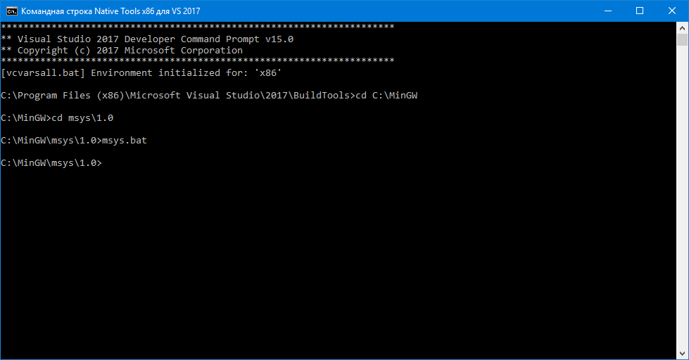
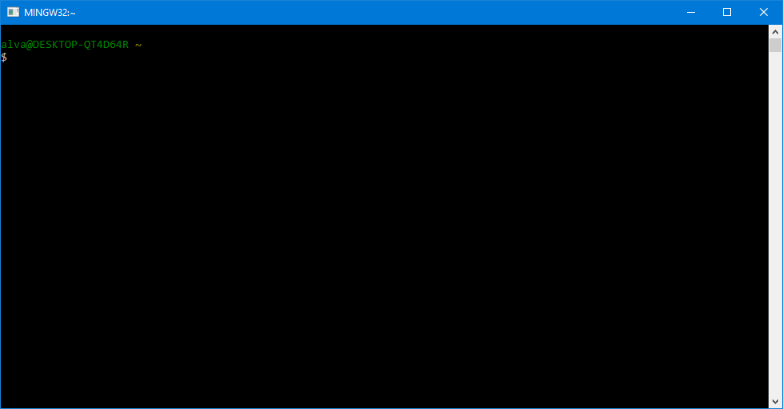

# 12. Компиляция nginx c расширением image_filter для Openserver-a
Небольшое отступление... Если у Вас возникла необходимость подключить расширение image_filter на windows, с вами определенно что-то не так...

Руководство от создателя nginx - [https://nginx.ru/en/docs/howto_build_on_win32.html](https://nginx.ru/en/docs/howto_build_on_win32.html), стоит обратить внимание что win32 не случайно, потому как сбилдить x64 у Вас не выйдет, поэтому и инструменты для сборки должны быть x86.
###Начнем:
* Для начала необходимо [скачать](https://www.visualstudio.com/ru/thank-you-downloading-visual-studio/?sku=BuildTools&rel=15) и установить vs_buildtools, ссылка для скачивания - [https://www.visualstudio.com/ru/thank-you-downloading-visual-studio/?sku=BuildTools&rel=15](https://www.visualstudio.com/ru/thank-you-downloading-visual-studio/?sku=BuildTools&rel=15). После загрузки и запуска Вам будет предложены компоненты на выбор, нас интересует только Visual C++ Build Tools.

* Установка [MSYS](http://www.mingw.org/wiki/MSYS). 
    * Для этого необходимо установить MinGW, а уже потом из него поставить MSYS, ссылка для скачивания - [https://sourceforge.net/projects/mingw/files/](https://sourceforge.net/projects/mingw/files/).
    
    * Далее сама установка MSYS. Выбираем вкладку All Packages (1), выбираем и помечаем на установку компонент mingw-developer-toolkit (2). После чего будет построенно дерево зависимостей компонентов и необходимо будет произвести установку, для этого в меню выбираем Installation -> Apply Changes (3) -> Apply (4). После этого произодет скачивание и установка пакетов.
    
    
* Установка [ActivePerl](https://www.activestate.com/activeperl), ссылка для скачивания - [https://www.activestate.com/activeperl/downloads](https://www.activestate.com/activeperl/downloads).
* Установка [Mercurial](https://www.mercurial-scm.org/), ссылка для скачивания - [https://www.mercurial-scm.org/downloads](https://www.mercurial-scm.org/downloads).
* Установка [GnuWin32](http://getgnuwin32.sourceforge.net/), ссылка для скачивания [https://sourceforge.net/projects/gnuwin32/files/gd/2.0.33-1/gd-2.0.33-1.exe/download?use_mirror=netix&download=](https://sourceforge.net/projects/gnuwin32/files/gd/2.0.33-1/gd-2.0.33-1.exe/download?use_mirror=netix&download=). (Установка производится по умолчанию в - C:\Program Files (x86)\GnuWin32)
* Перезагрузка
* Открываем консоль, переходим на диск С и скачиваем исходники nginx (команда - hg clone http://hg.nginx.org/nginx)
    
* Переходим в папку с исходниками nginx (C:\nginx\) и создаем папку objs, а в ней уже папку lib
* Скачиваем библиотеку [PCRE](http://www.pcre.org/), ссылка для скачивания - [https://sourceforge.net/projects/pcre/files/pcre/](https://sourceforge.net/projects/pcre/files/pcre/). И распаковываем ее в директорию C:\nginx\objs\lib.
    
* Скачиваем библиотеку [zlib](http://zlib.net/), ссылка для скачивания - [http://zlib.net/zlib-1.2.11.tar.gz](http://zlib.net/zlib-1.2.11.tar.gz). И распаковываем ее в директорию C:\nginx\objs\lib.
* Скачиваем библиотеку [OpenSSL](https://www.openssl.org/), ссылка для скачивания - [https://www.openssl.org/source/](https://www.openssl.org/source/). И распаковываем ее в директорию C:\nginx\objs\lib.
* Скачиваем библиотеку [libgd](https://libgd.github.io/), ссылка для скачивания (нас интересуют только исходники) - [https://github.com/libgd/libgd/releases](https://github.com/libgd/libgd/releases). И распаковываем ее в директорию C:\nginx\objs\lib.
    
* Запускаем "Командная строка Native Tools x86 для VS 2017" (Запускаем x86!).
    
* Запуск MSYS. Переходим в директорию куда производилась установка MinGW, в моем случае C:\MinGW, а затем в директорию MSYS (cd msys\1.0), и запускаем msys.bat.
    
    
* В консоле MSYS переходим в папку с исходниками nginx
    ```bash
    cd /c/nginx/
    ```
* Конфигурирование
    * По идеи перед запуском необходимо посмотреть с какими библиотеками собран nginx в OpenServer-e, для этого в консоли OpenServer-а надо запустить:
        ```bash
        nginx -V
        ```
    * Моя команда для конфигурирования. В нее необходимо внести коррективы в зависимости от вашего собранного уже OpenServer-e пакета, и изменить url к библиотекам (особое внимание уделите слешами в путях к библиотекам)): "--with-pcre=objs/lib/pcre-8.41", "--with-zlib=objs/lib/zlib-1.2.11", "--with-openssl=objs/lib/openssl-1.1.1-pre3", "--with-cc-opt="-DFD_SETSIZE=1024 -IC:/nginx/objs/lib/libgd-gd-2.2.5/src", "--with-ld-opt="C:/Program Files (x86)/GnuWin32/lib"". 
        ```bash
        auto/configure \
         --with-cc=cl \
         --builddir=objs \
         --with-debug \
         --prefix= \
         --conf-path=conf/nginx.conf \
         --pid-path=logs/nginx.pid \
         --http-log-path=logs/access.log \
         --error-log-path=logs/error.log \
         --sbin-path=nginx.exe \
         --http-client-body-temp-path=temp/client_body_temp \
         --http-proxy-temp-path=temp/proxy_temp \
         --http-fastcgi-temp-path=temp/fastcgi_temp \
         --http-scgi-temp-path=temp/scgi_temp \
         --http-uwsgi-temp-path=temp/uwsgi_temp \
         --with-pcre=objs/lib/pcre-8.41 \
         --with-zlib=objs/lib/zlib-1.2.11 \
         --with-openssl=objs/lib/openssl-1.1.1-pre3 \
         --with-openssl-opt=no-asm \
         --with-select_module \
         --with-http_v2_module \
         --with-http_realip_module \
         --with-http_addition_module \
         --with-http_sub_module \
         --with-http_dav_module \
         --with-http_stub_status_module \
         --with-http_flv_module \
         --with-http_mp4_module \
         --with-http_gunzip_module \
         --with-http_gzip_static_module \
         --with-http_auth_request_module \
         --with-http_random_index_module \
         --with-http_secure_link_module \
         --with-http_slice_module \
         --with-mail \
         --with-stream \
         --with-http_ssl_module \
         --with-mail_ssl_module \
         --with-stream_ssl_module \
         --with-http_image_filter_module \
         --with-cc-opt="-DFD_SETSIZE=1024 -IC:/nginx/objs/lib/libgd-gd-2.2.5/src" \
         --with-ld-opt="C:/Program Files (x86)/GnuWin32/lib"
        ```
