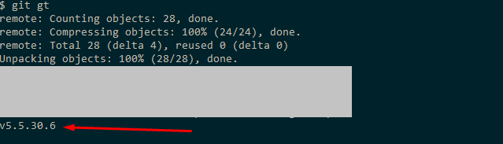

# 7. Комманда пуша в ветку релиз с тэгом
**копируем** файл git-pushRelease в директорию modules/git/bin 
после этого команда git pushRelease станет глобальной.

Формат использования **git pushRelease tagName**
Пример
```bash
git pushRelease v5.5.30.6
```
Команда создаст новый тэг и запушит его.
В файле .gitconfig описаны два алиаса
```bash
gt = git fetch && git describe --tags $(git rev-list --tags --max-count=1)
pr = pushRelease
```
, для укороченного вызова команды pushRelease ввиде **git pr tagName**.
Также для получения последнего созданного тэга добавлен alias gt.


