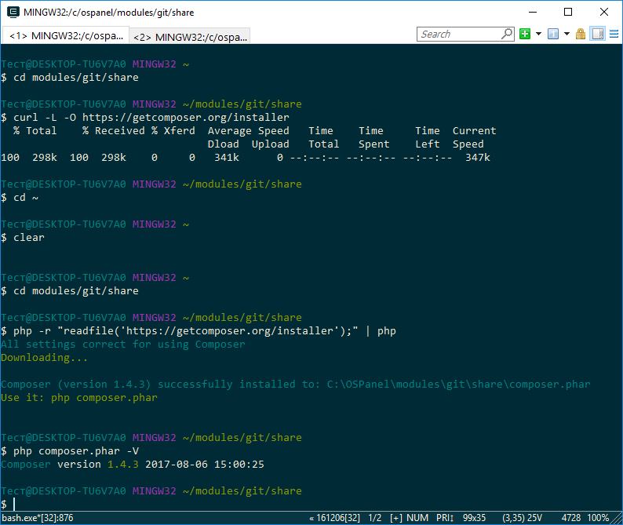

# 5. Установка composer
Переходим в директорию share
```
cd modules/git/share
```
cкачиваем composer
```
php -r "readfile('https://getcomposer.org/installer');" | php
```
**копируем** файл composer в директорию modules/git/bin 
после этого команда composer станет глобальной.

##### Важно: При смене версии php в модулях OpenServer-a, необходимо перезапустить консоль

