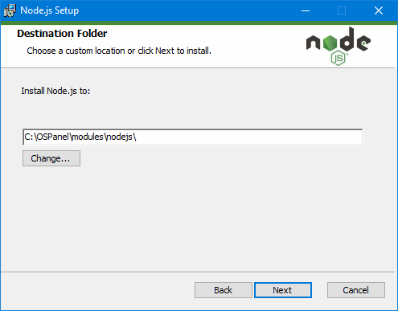

# 8. Установка npm, node.js
* [Скачать](https://nodejs.org/en/download/) и установить [node.js](https://nodejs.org/) в папку \modules\nodejs\. Ссылка для скачивания - [https://nodejs.org/en/download/](https://nodejs.org/en/download/)
 
* Необходимо раскомментировать строку подключения окружения в файле \~/.bashrc (export PATH=$PATH:~/modules/nodejs), после этого команда npm и node станет доступен в консоли.

Проверить можно командами:
```bash
npm
```
и
```bash
node --help
```
