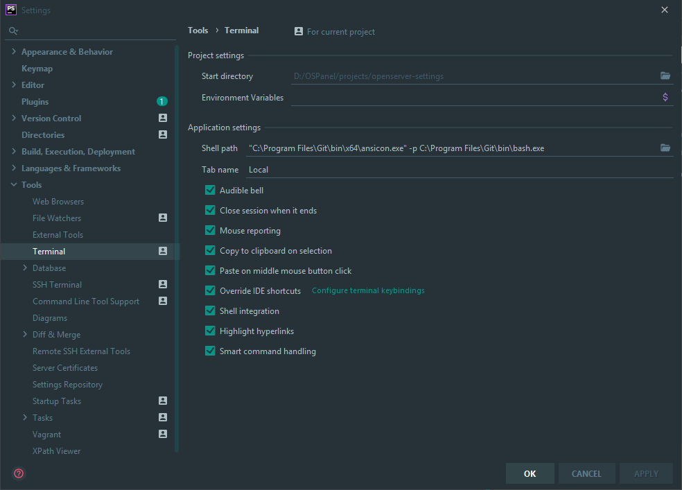

# 13. Дружим phpStorm и Git Bash
Для получения доступа к терминалу gitBash из phpStorm(или любой другой IDE из семейства jetbrains)  необходимо прописать "Shell path" к gitBash-у. Прописать можно путь как к установленому в Openserver-e "D:\OSPanel\modules\git\bin\bash.exe", так и к обычному "C:\Program Files\Git\bin\bash.exe".
Для поддержки ansi цветов (?[37;41m) необходимо скачать [ansicon](https://github.com/adoxa/ansicon/releases).
Далее открываем архив ansi...-bin.zip и переносим папку x64 в "C:\Program Files\Git\bin\" (путь не важен, можно выбрать любую другую папку). После этого меняем "Shell path" на
```bash
"C:\Program Files\Git\bin\x64\ansicon.exe" -p C:\Program Files\Git\bin\bash.exe
```
 
