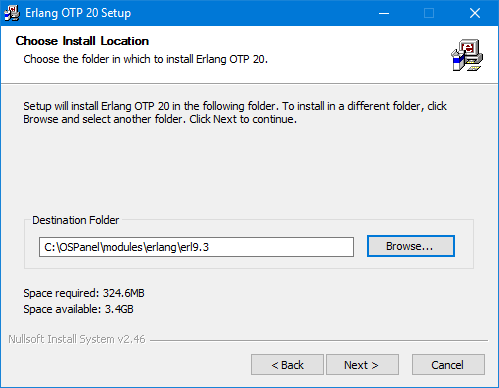
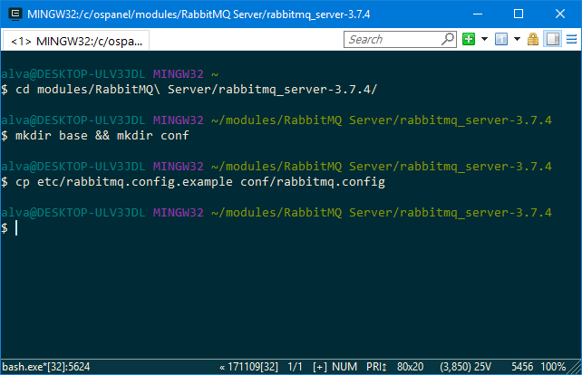

# 11. RabbitMQ
* [Скачать](http://www.erlang.org/downloads) и установить [erlang](http://www.erlang.org) в папку \modules\erlang\. Ссылка для скачивания - [http://www.erlang.org/downloads](http://www.erlang.org/downloads)

* [Скачать](https://www.rabbitmq.com/install-windows.html) и установить [rabbitmq](https://www.rabbitmq.com) в папку \modules\RabbitMQ Server\. Ссылка для скачивания - [https://www.rabbitmq.com/install-windows.html](https://www.rabbitmq.com/install-windows.html)
  
* Перейти в директорию /modules/RabbitMQ\ Server/ваша-версия/, создать директории base(база данных, логи) и conf(конфиг), и скопировать файл конфига из etc в директорию conf - под именем rabbitmq.config.

* 

https://nginx.ru/en/docs/howto_build_on_win32.html

http://gnuwin32.sourceforge.net/packages/gd.htm